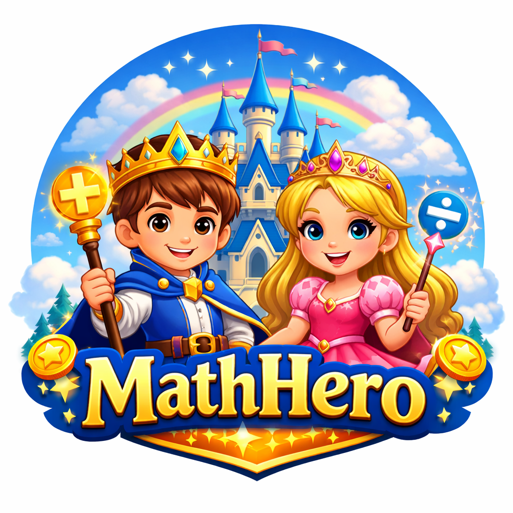

  

<h1 align="center">MathHero</h1>

  <strong>A magical math adventure for kids</strong>

  <a href="https://atlasbioinfo.github.io/MathHero/">https://atlasbioinfo.github.io/MathHero/</a>

  <a href="./README_CN.md">中文</a>

---

## Features

**Practice Operations**
- Addition, Subtraction, Multiplication, Division
- Fractions (same/different denominators, mixed operations)
- 6 progressive difficulty levels per operation

**Gamification**
- Earn coins for correct answers and completing levels
- Collect stickers and achievements
- Daily challenges with streak bonuses
- Shop to unlock themes, avatar frames, and decorations

**Kid-Friendly Design**
- Choose your character: Math Prince or Math Princess
- Beautiful pink/blue themed worlds
- Celebration confetti for achievements
- Encouraging feedback messages

**Learning Tools**
- Wrong question review and practice
- Progress statistics and reports
- Screen time limit with parental PIN protection
- Customizable difficulty ranges

**More**
- Works offline (PWA)
- Dark mode
- Multi-language (EN, ZH, ES, FR, DE)
- Multi-user profiles
- All data stored locally - your privacy is protected

## The Story

> This app was born when I was doing math practice with my daughter and thought: "Wouldn't it be wonderful to have a fun, magical app to make learning math an adventure?" And so, the Math Kingdom was created!

If you have ideas to make it better, please share them on GitHub! Wishing all little mathematicians great success!

## Contributing

Contributions are welcome! Feel free to report bugs or suggest new features.

## License

MIT
